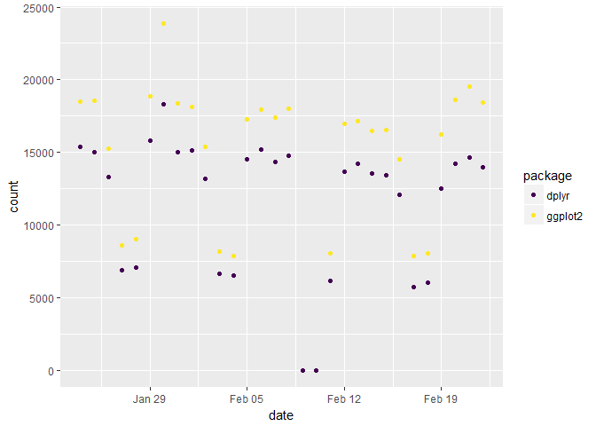
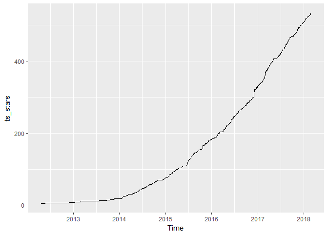
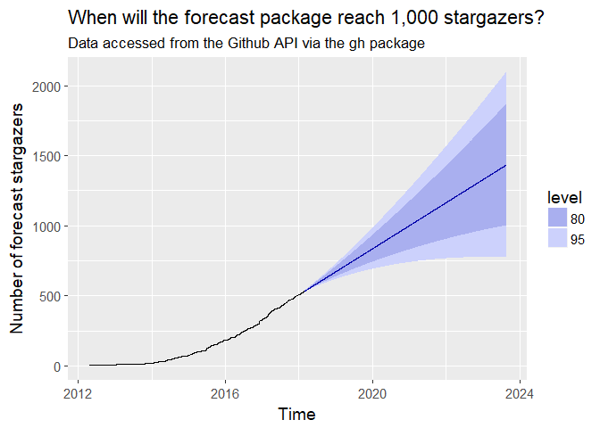

Package analytics
================
M. Salmon
February 24, 2018

CRAN logs
---------

``` r
ggplot2_logs <- cranlogs::cran_downloads(packages = c("ggplot2", "dplyr"),
                                         when = "last-month")
library("ggplot2")
ggplot(ggplot2_logs) +
  geom_point(aes(date, count, col = package)) +
  viridis::scale_color_viridis(discrete = TRUE)
```



GitHub stargazers
-----------------

``` r
library("gh")
library("lubridate")
```

    ## 
    ## Attaching package: 'lubridate'

    ## The following object is masked from 'package:base':
    ## 
    ##     date

``` r
library("ggplot2")
library("viridis")
```

    ## Loading required package: viridisLite

``` r
library("dplyr")
```

    ## 
    ## Attaching package: 'dplyr'

    ## The following objects are masked from 'package:lubridate':
    ## 
    ##     intersect, setdiff, union

    ## The following objects are masked from 'package:stats':
    ## 
    ##     filter, lag

    ## The following objects are masked from 'package:base':
    ## 
    ##     intersect, setdiff, setequal, union

``` r
library("tidyr")
library("viridis")
library("forecast")
library("janitor")

# get data, loop because pagination
stardates <- NULL

geht <- TRUE
page <- 1
while(geht){
  print(page)
  stars <- try(gh("/repos/robjhyndman/forecast/stargazers",
              .token = Sys.getenv("GITHUB_TOKEN"),
              .send_headers = c("Accept" = 'application/vnd.github.v3.star+json'),
              page = page))
  
  geht <- stars != ""
  
  if(geht){
    stardates <- c(stardates, vapply(stars, "[[", "", "starred_at"))
    page <- page + 1
    }
  
  
}
```

    ## [1] 1

    ## Warning in if (geht) {: the condition has length > 1 and only the first
    ## element will be used

    ## Warning in while (geht) {: the condition has length > 1 and only the first
    ## element will be used

    ## [1] 2

    ## Warning in if (geht) {: the condition has length > 1 and only the first
    ## element will be used

    ## Warning in if (geht) {: the condition has length > 1 and only the first
    ## element will be used

    ## [1] 3

    ## Warning in if (geht) {: the condition has length > 1 and only the first
    ## element will be used

    ## Warning in if (geht) {: the condition has length > 1 and only the first
    ## element will be used

    ## [1] 4

    ## Warning in if (geht) {: the condition has length > 1 and only the first
    ## element will be used

    ## Warning in if (geht) {: the condition has length > 1 and only the first
    ## element will be used

    ## [1] 5

    ## Warning in if (geht) {: the condition has length > 1 and only the first
    ## element will be used

    ## Warning in if (geht) {: the condition has length > 1 and only the first
    ## element will be used

    ## [1] 6

    ## Warning in if (geht) {: the condition has length > 1 and only the first
    ## element will be used

    ## Warning in if (geht) {: the condition has length > 1 and only the first
    ## element will be used

    ## [1] 7

    ## Warning in if (geht) {: the condition has length > 1 and only the first
    ## element will be used

    ## Warning in if (geht) {: the condition has length > 1 and only the first
    ## element will be used

    ## [1] 8

    ## Warning in if (geht) {: the condition has length > 1 and only the first
    ## element will be used

    ## Warning in if (geht) {: the condition has length > 1 and only the first
    ## element will be used

    ## [1] 9

    ## Warning in if (geht) {: the condition has length > 1 and only the first
    ## element will be used

    ## Warning in if (geht) {: the condition has length > 1 and only the first
    ## element will be used

    ## [1] 10

    ## Warning in if (geht) {: the condition has length > 1 and only the first
    ## element will be used

    ## Warning in if (geht) {: the condition has length > 1 and only the first
    ## element will be used

    ## [1] 11

    ## Warning in if (geht) {: the condition has length > 1 and only the first
    ## element will be used

    ## Warning in if (geht) {: the condition has length > 1 and only the first
    ## element will be used

    ## [1] 12

    ## Warning in if (geht) {: the condition has length > 1 and only the first
    ## element will be used

    ## Warning in if (geht) {: the condition has length > 1 and only the first
    ## element will be used

    ## [1] 13

    ## Warning in if (geht) {: the condition has length > 1 and only the first
    ## element will be used

    ## Warning in if (geht) {: the condition has length > 1 and only the first
    ## element will be used

    ## [1] 14

    ## Warning in if (geht) {: the condition has length > 1 and only the first
    ## element will be used

    ## Warning in if (geht) {: the condition has length > 1 and only the first
    ## element will be used

    ## [1] 15

    ## Warning in if (geht) {: the condition has length > 1 and only the first
    ## element will be used

    ## Warning in if (geht) {: the condition has length > 1 and only the first
    ## element will be used

    ## [1] 16

    ## Warning in if (geht) {: the condition has length > 1 and only the first
    ## element will be used

    ## Warning in if (geht) {: the condition has length > 1 and only the first
    ## element will be used

    ## [1] 17

    ## Warning in if (geht) {: the condition has length > 1 and only the first
    ## element will be used

    ## Warning in if (geht) {: the condition has length > 1 and only the first
    ## element will be used

    ## [1] 18

    ## Warning in if (geht) {: the condition has length > 1 and only the first
    ## element will be used

    ## Warning in if (geht) {: the condition has length > 1 and only the first
    ## element will be used

    ## [1] 19

``` r
stardates <- lubridate::ymd_hms(stardates)

# make table of counts per day
star_table <- data.frame(time = stardates)
star_table <- mutate(star_table, date = as.Date(time))
star_table <- group_by(star_table, date) %>%
  summarize(n = n()) 
star_table <- mutate(star_table, 
                     cum_n = cumsum(n))

complete_dates <- seq(from = min(star_table$date),
                      to = max(star_table$date),
                      by = "1 day")

# prepare ts
ts_prep <- data.frame(date = complete_dates)
ts_prep <- left_join(ts_prep, star_table,
                     by = "date")
ts_prep <- mutate(ts_prep, cum_n = zoo::na.locf(cum_n))

ts_stars <- xts::xts(ts_prep$cum_n, ts_prep$date)
ts_stars = ts(ts_stars, freq=365, start=c(2012, 113))
autoplot(ts_stars)
```



``` r
# forecast
pred <- forecast(ets(ts_stars), h = 2000)
```

    ## Warning in ets(ts_stars): I can't handle data with frequency greater than
    ## 24. Seasonality will be ignored. Try stlf() if you need seasonal forecasts.

``` r
# plot
theme_set(theme_gray(base_size = 14))
autoplot(pred) +
  ylab("Number of forecast stargazers") +
  ggtitle("When will the forecast package reach 1,000 stargazers?",
          subtitle = "Data accessed from the Github API via the gh package")
```


