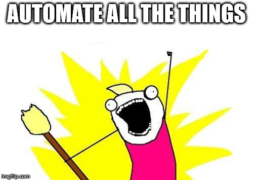
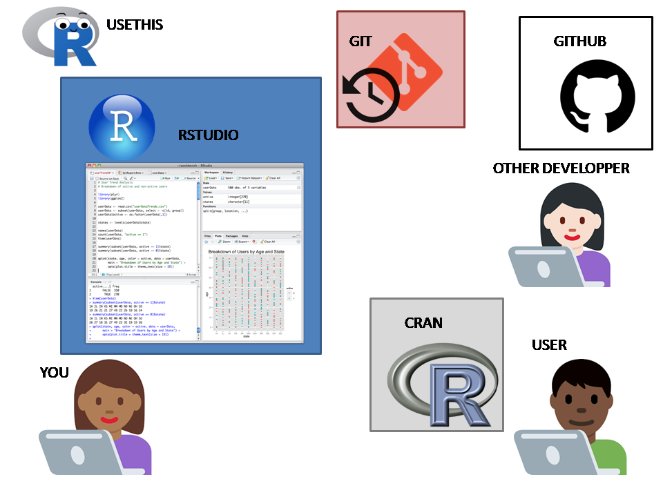
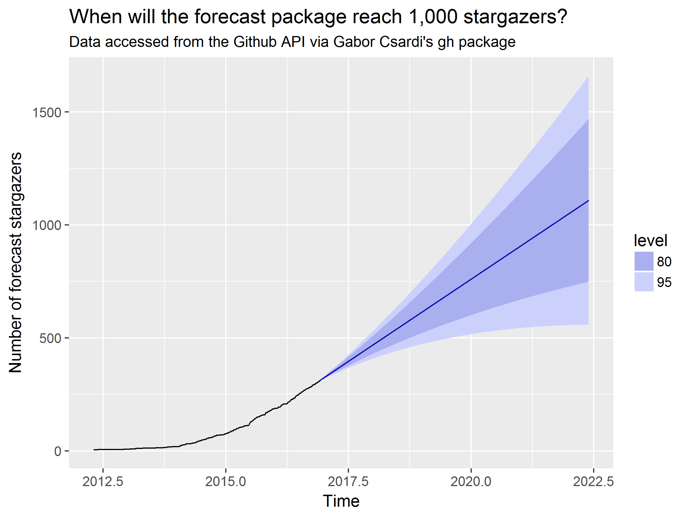

```{r setup, include=FALSE}
options(htmltools.dir.version = FALSE)
knitr::opts_chunk$set(echo = TRUE, cache = TRUE)
```

## Good morning! Goeie môre! Sanibonani! Molweni! Bonjour!

What I do in R...

* (Research) software engineer for rOpenSci & Locke Data.

* R-Ladies, R Weekly.

* Onboarding co-editor at rOpenSci.


---

## Why learning about package development?

Jon Calder's very good wording, thanks Jon!

--

* To share code (and data)

--

* To leverage existing tooling

--

* To contribute to other packages


---

## Who can write a package? YOU!

Susan Johnston's [very good slide](https://github.com/susjoh/fibonacci).


---

## Automation!




---

## Automating... How?

Remember Clippy?


---


## Automating... How?

Get to know an actually useful Clippy, `usethis`!


---

## `usethis` and co

<blockquote class="twitter-tweet" data-lang="ca"><p lang="en" dir="ltr">The usethis package implements this important principle: Automate that which can be automated. Your computer was literally born to implement rote-but-fussy stuff for you. <a href="https://t.co/OfIUzSBlc7">https://t.co/OfIUzSBlc7</a></p>&mdash; Jenny Bryan (@JennyBryan) <a href="https://twitter.com/JennyBryan/status/935562495816753153?ref_src=twsrc%5Etfw">28 de novembre de 2017</a></blockquote>

--

We shall use this ecosystem today:

* `RStudio`

* `devtools` and `usethis`

* `roxygen2`


---
## Today's workshop

--

* Hands-on! Is every laptop ready?

--

* These slides, hands-on, then a few slides again.

--

* Ask and help us help you!

--

* You should go home knowing the basics and how to go further.

---
## Today's package

`iemand`, create fake people.

* Inspired by [`charlatan`](https://github.com/ropensci/charlatan), "create fake data in R".

* real baby names data from Stats SA.

---

## Let's go!

<iframe src="https://giphy.com/embed/XOvKIu18WbpgQ" width="480" height="480" frameBorder="0" class="giphy-embed" allowFullScreen></iframe><p><a href="https://giphy.com/gifs/XOvKIu18WbpgQ">via GIPHY</a></p>

---

## Session 1

Minimal package, git and GitHub repo.

--

* [Hilary Parker's famous blog post _Writing an R package from scratch_: https://hilaryparker.com/2014/04/29/writing-an-r-package-from-scratch/](https://hilaryparker.com/2014/04/29/writing-an-r-package-from-scratch/)
  
* [this pictorial by Matthew J Denny: http://www.mjdenny.com/R_Package_Pictorial.html](http://www.mjdenny.com/R_Package_Pictorial.html)

* [http://happygitwithr.com/](http://happygitwithr.com/)

* [Get closer to developer bliss! http://usethis.r-lib.org/articles/articles/usethis-setup.html](http://usethis.r-lib.org/articles/articles/usethis-setup.html)

---

## Session 2

* An unit test

* A function using external packages

* Data (and a function using it)

--

[_R packages_ by Hadley Wickham http://r-pkgs.had.co.nz/](http://r-pkgs.had.co.nz/)

---

## Session 3

* How to automatically check your package

* GitHub exploration

--

[http://www.masalmon.eu/2017/06/17/automatictools/](http://www.masalmon.eu/2017/06/17/automatictools/)

[http://happygitwithr.com/](http://happygitwithr.com/)

`use_github_links`, `use_readme_md`, `use_code_of_conduct`

---

## Session 4

* vignette, `pkgdown` website

* package analytics

---

## `pkgdown`

Quick demo

--

[http://enpiar.com/2017/11/21/getting-down-with-pkgdown/](http://enpiar.com/2017/11/21/getting-down-with-pkgdown/)

---

## Package analytics

* `cranlogs` package

* `gh` package 

* Track uses of your package http://happygitwithr.com/search.html (you can do that with `gh`!)

---

## Package analytics: CRAN logs --  a note on CRAN




--


`devtools::release`, release on GitHub + NEWS.md

---

## Package analytics: CRAN logs

```{r, fig.height = 6}
ggplot2_logs <- cranlogs::cran_downloads(packages = c("ggplot2", "dplyr"),
                                         when = "last-month")
ggplot2::ggplot(ggplot2_logs) +
  ggplot2::geom_line(aes(date, count, col = package)) +
  viridis::scale_color_viridis(discrete = TRUE)

```

---

## Package analytics: GitHub stargazers



[https://github.com/maelle/forecast_stars](https://github.com/maelle/forecast_stars)

---

## Package analytics: GitHub search

Search GitHub [https://github.com/search?utf8=%E2%9C%93&q=%22riem_measures%22+language%3AR&type=Code](https://github.com/search?utf8=%E2%9C%93&q=%22riem_measures%22+language%3AR&type=Code)

Search GitHub via `gh`: [http://www.masalmon.eu/2017/04/12/seeds/](http://www.masalmon.eu/2017/04/12/seeds/)

Use GitHub archive? [http://www.masalmon.eu/2017/12/21/wherehaveyoubeen/](http://www.masalmon.eu/2017/12/21/wherehaveyoubeen/)

---

## What more could you try out now

* `usethis` setup

* more functions? more tests? more docs?

* more collaboration and review?

* more analytics?

---

## How to go further: your own package(s)?

My own blog post with many links to fantastic resources: ["How to develop good R packages"](http://www.masalmon.eu/2017/12/11/goodrpackages/)

Two further tips:

* Advertise your package via R Weekly, PR to the "new packages" or "new releases" category!

* Use the `foghorn` package to get CRAN check results of your packages.

---

## How to go further: your research compendii?

Research compendium = R package containing all the code (and data) incl. dependencies list, necessary to reproduce an article.


See [this thread for instance](https://github.com/ropensci/unconf17/issues/5).

---

## How to go further: contribute to other packages?

--

* rOpenSci onboarding (more on that tomorrow!) and [contributr Shiny app](https://github.com/LucyMcGowan/contributr).

--

*  Mara Averick's ["contributing to the tidyverse"](https://github.com/batpigandme/tverse_contributing/blob/master/tverse_contributing_rstudioconf_compressed.pdf) slides, [tidyverse contributing guide](https://www.tidyverse.org/contribute/), [Jim Hester's blog post "contributing code to the tidyverse"](http://www.jimhester.com/2017/08/08/contributing/).


---

## Last but not least, what about `iemand`?

--

*  Ask more data from Stats SA?

--

*  Andrew Collier's [`saffeR`](https://github.com/DataWookie/saffeR), an R package aggregating a selection of things relating to South Africa. 

* Julia Silge's [`southafricastats`](https://github.com/juliasilge/southafricastats), Population and Mortality Statistics for South Africa, built to support her introductory Shiny workshop at the February 2017 satRday conference.


---

## See you tomorrow! Sien jou môre! Ngizokubona kusasa! Ndiza nibona ngomso!

<iframe src="https://giphy.com/embed/l4KibK3JwaVo0CjDO" width="480" height="474" frameBorder="0" class="giphy-embed" allowFullScreen></iframe><p><a href="https://giphy.com/gifs/afv-funny-fail-lol-l4KibK3JwaVo0CjDO">via GIPHY</a></p>


